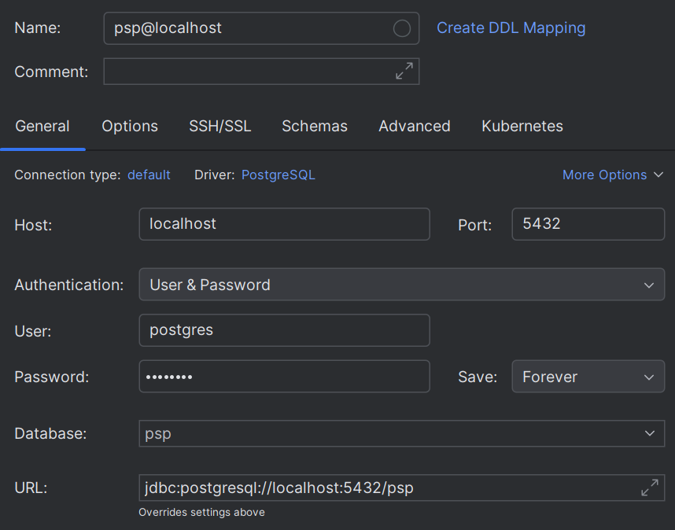

# PSP
Payment Service Provider.  
This service provides us with the ability to create real transactions (top up, withdrawal), send webhooks and check the merchant balance

 

### Запуск тестов в Intellij Idea

1) Скачайте проект;
2) Запустите `Docker` на локальной машине для Testcontainers;
3) Запустите task `test` в `Gradle`.

### Запуск проекта в Intellij Idea

1) Скачайте проект и откройте его в среде разработки;
2) Создайте БД на локальной машине, например `psp`;
3) Исправьте конфигурацию в `src\main\resources\application-dev.yml` подставив актуальные значения в:
   - `POSTGRES_PASSWORD`;
   - `POSTGRES_USERNAME`;
4) Добавьте в проект datasource с актуальными данными:
   
5) Запустите SQL-скрипты для наполнения БД тестовыми данными:
```sql
-- Users:
INSERT INTO data.users (type) VALUES ('MERCHANT'); -- 1) Smirnov_API_ID
INSERT INTO data.users (type) VALUES ('CUSTOMER'); -- 2) Ivanov
INSERT INTO data.users (type) VALUES ('CUSTOMER'); -- 3) Petrov
INSERT INTO data.users (type) VALUES ('CUSTOMER'); -- 4) Sidorov
-- Мерчант и клиенты:
INSERT INTO data.merchants (user_id, api_id, api_key, ip_addresses) VALUES (1, 'Smirnov_API_ID', '123456789', ARRAY ['127.0.0.1', '0:0:0:0:0:0:0:1', 'kubernetes.docker.internal']); -- 1) Smirnov_API_ID
INSERT INTO data.customers (user_id, first_name, last_name, country) VALUES (2, 'Ivan', 'Ivanov', 'BY');  -- 2) Ivanov
INSERT INTO data.customers (user_id, first_name, last_name, country) VALUES (3, 'Petr', 'Petrov', 'RU');  -- 3) Petrov
INSERT INTO data.customers (user_id, first_name, last_name, country) VALUES (4, 'Sidr', 'Sidorov', 'BY'); -- 4) Sidorov
-- Аккаунты с балансами:
INSERT INTO data.accounts (user_id, number, balance, currency) VALUES (1, 'BY34MERCH030140012964136000716', 5000, 'BYN'); -- 1) Smirnov_API_ID
INSERT INTO data.accounts (user_id, number, balance, currency) VALUES (1, 'RU83MERCH361407000843083139443', 5000, 'RUB'); -- 2) Smirnov_API_ID
INSERT INTO data.accounts (user_id, number, balance, currency) VALUES (2, 'BY03CUSTOM30140900044303134462', 2000, 'BYN'); -- 3) Ivanov
INSERT INTO data.accounts (user_id, number, balance, currency) VALUES (3, 'RU78CUSTOM50170908044903122461', 1000, 'RUB'); -- 4) Petrov
INSERT INTO data.accounts (user_id, number, balance, currency) VALUES (4, 'BY61CUSTOM92926419542716940328', 1000, 'BYN'); -- 5) Sidorov
-- Банковские карты клиентов:
INSERT INTO data.cards (account_id, card_number, exp_date, cvv, card_status) VALUES (3, '9112831820410277', '11/25', 566, 'ACTIVE'); -- 1) Ivanov
INSERT INTO data.cards (account_id, card_number, exp_date, cvv, card_status) VALUES (4, '4102778822334893', '08/26', 211, 'ACTIVE'); -- 2) Petrov
INSERT INTO data.cards (account_id, card_number, exp_date, cvv, card_status) VALUES (5, '9112395776302856', '10/29', 849, 'ACTIVE'); -- 3) Sidorov
```
6) Запустите проект в среде разработки.
7) [Скачайте](https://github.com/itbatia/psp-client/archive/refs/heads/main.zip) и запустите как описано в 
[README](https://github.com/itbatia/psp-client) клиент для `PSP`, который имитирует работу API мерчанта.  
`PSP-client` принимает HTTP-запросы (вебхуки) от `PSP` и возвращает ответы.
8) В файле `HttpRequests.http` подготовлены все запросы по созданию транзакций и получения информации по ним:
   - Create transaction (topup)
   - Create transaction (payout)
   - Get transaction list with query params
   - Get transaction list without query params
   - Get Transaction details
